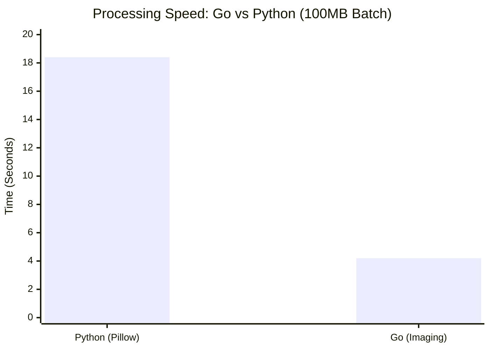
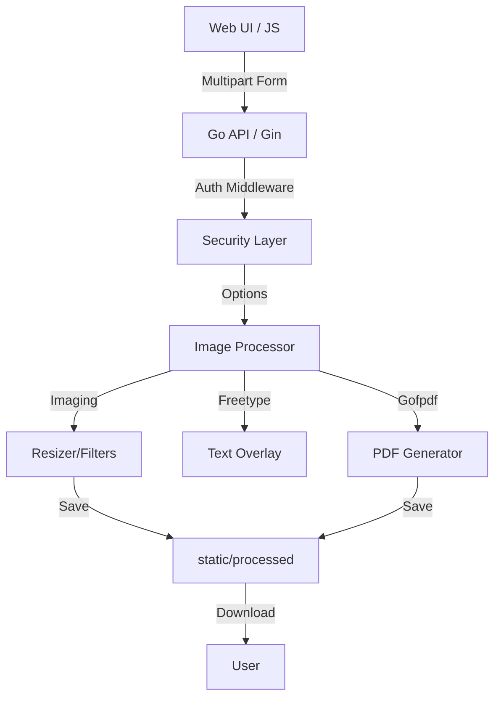

#  Image Resizer Pro (Go Edition)


**High-performance, secure, and modern image processing suite built with Go and Gin-Gonic.**

---

## 🚀 Key Features

| 🎭 **Artistic** | 📐 **Transform** | 🛠️ **Utility** |
| :--- | :--- | :--- |
| **Filters:** Noir, Vivid, Sepia, Invert, Grayscale | **Smart Crop:** 1:1, 16:9, 4:3 | **Batch Rename:** Custom templates |
| **Adjustments:** Brightness, Contrast, Saturation | **Resize:** % or Pixel accurate | **Zip Bundling:** Batch downloads |
| **Effects:** Pixelate, Blur, Sharpen | **Rotate:** 90°, 180°, 270° | **PDF Export:** Images to Document |
| **Overlays:** Text (Custom Font), Image | **Flip:** Horizontal & Vertical | **EXIF Strip:** Privacy protection |

---

## 📊 Performance Benchmark


*Note: The figures shown above are illustrative/approximate.*

---

## 🏗️ Architecture



---

## 🛠️ Tech Stack

- **Backend:** [Go 1.26.4+](https://go.dev/) + [Gin-Gonic](https://gin-gonic.com/)
- **Processing:** [Imaging](https://github.com/disintegration/imaging), [Freetype](https://github.com/golang/freetype), [Gofpdf](https://github.com/jung-kurt/gofpdf)
- **Frontend:** Glassmorphism UI (Vanilla CSS + Vanilla JS)
- **DevOps:** GitHub Actions, Docker (Alpine Multi-stage), [gosec](https://github.com/securego/gosec), [govulncheck](https://pkg.go.dev/golang.org/x/vuln/cmd/govulncheck)

---

## 🚦 Quick Start

### 📦 Run with Docker
```bash
docker pull ghcr.io/arumes31/image-resizer:latest
docker run -p 5000:5000 ghcr.io/arumes31/image-resizer:latest
```

### 🔨 Development Mode
```bash
go run cmd/server/main.go
```
Open `http://localhost:5000` to access the dashboard.

---

## 🧑‍💻 Developer API

The suite includes a secure REST API for headless automation.

**Authentication:**
All API endpoints (except `/api/v1/status`) require an API key passed via the HTTP headers.
- **Header:** `X-API-Key`
- **Value:** Your configured secure key.

### Endpoints

#### 1. System Status
- **Method:** `GET`
- **Path:** `/api/v1/status`
- **Description:** Check system health and current API version.
- **Response:**
  ```json
  {
    "status": "operational",
    "version": "v2.0.0-go"
  }
  ```

#### 2. Process Images
- **Method:** `POST`
- **Path:** `/api/v1/process`
- **Content-Type:** `multipart/form-data`
- **Description:** Upload one or more images and apply various transformations, filters, and optimizations.

**Form Parameters:**

| Parameter | Type | Default | Description |
| :--- | :--- | :--- | :--- |
| `files[]` | File | - | **(Required)** Images to process. Allowed: jpg, png, gif, bmp, tiff, webp, ico |
| `operation` | String | `percentage` | The resize operation: `percentage` or `fill` |
| `percentage` | Integer | `100` | Scale percentage (max: 500) |
| `width` | Integer | `0` | Target width in pixels |
| `height` | Integer | `0` | Target height in pixels |
| `quality` | Integer | `85` | Output image quality (1-100) |
| `rotation` | Integer | `0` | Degrees to rotate: `0`, `90`, `180`, `270` |
| `brightness` | Float | `0` | Adjust brightness |
| `contrast` | Float | `0` | Adjust contrast |
| `saturation` | Float | `0` | Adjust saturation |
| `pixelate` | Integer | `0` | Pixelation factor |
| `watermark` | File | - | Image file to use as a watermark overlay |
| `format` | String | Original | Output format (e.g., `jpg`, `png`, `webp`, `pdf`) |
| `resize_method` | String | - | Resampling method |
| `flip` | String | - | Flip direction: `horizontal`, `vertical` |
| `filters[]` | String Array| - | Array of filters (e.g., Noir, Vivid, Sepia) |
| `text_overlay` | String | - | Text to render over the image |
| `text_color` | String | - | Hex color code for the text overlay |
| `strip_exif` | String | - | Set to `on` to remove EXIF metadata |
| `copyright` | String | - | Copyright text to embed in metadata |
| `crop` | String | - | Crop aspect ratio |
| `vignette` | String | - | Set to `on` to apply a vignette effect |
| `rename_template`| String | - | Template for renaming output files |

**Responses:**

*Success (200 OK):*
```json
{
  "results": [
    {
      "OriginalName": "photo.jpg",
      "ProcessedName": "processed_photo.jpg",
      "OriginalSize": "1.5 MB",
      "NewSize": "450 KB",
      "NewFilePath": "static/processed/processed_photo.jpg"
    }
  ]
}
```

*Partial Failure (200 OK):*
If some files fail but others succeed, the response includes both `results` and `errors` arrays.

*Unprocessable Entity (422 Unprocessable Entity):*
Returned if all uploaded files fail to process. Includes an `errors` array.

*Bad Request (400 Bad Request):*
Returned for invalid form data or unallowed file extensions.

---

## 🔒 Security & Privacy
- **Privacy:** One-click EXIF stripping removes metadata (GPS, Timestamps).
- **Safety:** Constant-time comparison for API keys; 500% scaling cap to prevent memory exhaustion (enforced in `handleUpload` in `internal/server/server.go`).
- **Audited:** Scanned with `gosec` and `govulncheck` on every commit.

---
*Built with ❤️ by arumes31 - 2026 Edition*
