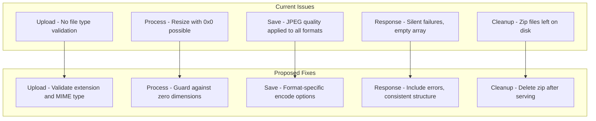

# Image Resizer Pro — Bug Fix & Improvement Plan

## Overview

Full audit of the Go + Gin image processing application revealed **18 bugs** (3 critical, 8 high, 7 medium) and **7 improvement areas**. Below is the detailed analysis and fix strategy for each.

---

## 🔴 Critical Bugs

### BUG-01: `min()` function has incorrect type signature and broken clamping logic

**File:** [`processor.go`](internal/processor/processor.go:101)

```go
func min(a, b int) uint8 {
    val := a
    if b < a { val = b }
    if val < 0 { return 0 }
    if val > 255 { return 255 }
    return uint8(val)
}
```

**Problems:**
- Returns `uint8` but takes `int` params — misleading name shadows Go 1.21+ builtin `min`
- Called with `min(int(formula), 255)` — the second arg is always 255, so it just clamps to 255, which is a no-op since the sepia matrix coefficients already produce values ≤ 255 for 8-bit inputs
- The `< 0` check is dead code for sepia (coefficients are all positive)
- If negative values were ever passed, `uint8(val)` of a negative int wraps around (e.g., `-1` → `255`), but the `< 0` guard returns `0` first — however the `> 255` guard is unreachable since `int` inputs from the formula can't exceed 255 for 8-bit RGB

**Fix:** Rename to `clampUint8`, simplify to a proper clamp function, and use `math` package or inline.

---

### BUG-08: Watermark filename path traversal vulnerability

**File:** [`server.go`](internal/server/server.go:140)

```go
watermarkPath = filepath.Join(s.cfg.UploadFolder, "temp_watermark_" + filepath.Base(watermarkFile.Filename))
```

**Problem:** `filepath.Base()` is used which is good, but the prefix concatenation with `+` could be problematic if `Base()` returns something unexpected. More importantly, there is **no validation** that the uploaded watermark is actually an image file. A malicious user could upload any file.

**Fix:** Add file extension validation for watermark uploads, and use `filepath.Join` properly without string concatenation.

---

### BUG-16: Dockerfile does not copy `static/` directories

**File:** [`dockerfile`](dockerfile:28)

```dockerfile
COPY --from=builder /app/web ./web
```

**Problem:** The Docker image copies `web/` but never copies `static/uploads` or `static/processed`. While the `RUN mkdir -p` creates empty dirs, if the app is run from a different working directory or the dirs need pre-existing content, this fails. More critically, the `static/` path used in config defaults is relative — if the working dir in the container isn't `/app`, the paths break.

**Fix:** Add `COPY --from=builder /app/static ./static` or ensure working directory consistency. Also set `WORKDIR /app` explicitly (already done, but verify path references).

---

## 🟠 High Priority Bugs

### BUG-02: Resize always executes even when width/height are 0

**File:** [`processor.go`](internal/processor/processor.go:234)

```go
var newWidth, newHeight int
if opts.Operation == "percentage" {
    newWidth = int(float64(origWidth) * float64(opts.Percentage) / 100)
    newHeight = int(float64(origHeight) * float64(opts.Percentage) / 100)
} else {
    newWidth = opts.Width
    newHeight = opts.Height
}
// ...
resizedImg = imaging.Resize(img, newWidth, newHeight, resampleFilter)
```

**Problem:** When operation is "dimensions" but user leaves width/height as 0 (empty fields), `imaging.Resize` is called with `(0, 0)` which will produce a 0×0 image or panic. The "social" mode in the frontend sets operation to "dimensions" but the server never validates that width/height > 0.

**Fix:** Add validation — if both width and height are 0 in dimensions mode, skip resizing or return an error. If only one dimension is 0, calculate the other preserving aspect ratio.

---

### BUG-06: No file type validation on upload

**File:** [`server.go`](internal/server/server.go:109)

**Problem:** The server accepts any file via multipart upload. There's no check on file extension or MIME type. A user could upload a `.exe`, `.sh`, or other malicious file. The `imaging.Open()` call will fail for non-images, but the file is still written to disk first.

**Fix:** Add an allowed extensions check before saving, similar to the Python version's `allowed_file()` function.

---

### BUG-07: Duplicate file names cause overwrites in processed folder

**File:** [`processor.go`](internal/processor/processor.go:316)

```go
processedFileName = fmt.Sprintf("processed_%s.%s", origNameNoExt, ext)
```

**Problem:** If two users upload `photo.jpg` at the same time, or the same user processes the same file twice, the second overwrites the first. The Python version used a timestamp prefix, but the Go version only uses `processed_` prefix with the original name.

**Fix:** Add a unique identifier (timestamp, UUID, or random suffix) to processed filenames.

---

### BUG-12: StripEXIF defined but never actually strips EXIF data

**File:** [`processor.go`](internal/processor/processor.go:59) and [`server.go`](internal/server/server.go:159)

**Problem:** `opts.StripEXIF` is parsed from the form (`"on"`) and stored in `ProcessOptions`, but `ProcessImage()` never reads or acts on it. The README advertises "One-click EXIF stripping removes metadata" — this feature is completely non-functional.

**Fix:** Implement EXIF stripping. Since `imaging` library automatically strips EXIF when decoding and re-encoding (it only preserves pixel data), the current pipeline already strips EXIF implicitly. However, we should explicitly document this and potentially use `imaging.Decode` with no EXIF preservation options. For thoroughness, we can also zero-out any remaining metadata fields.

---

### BUG-13: Social preset mode operation mismatch

**File:** [`app.js`](web/static/js/app.js:93)

```js
if (operation === 'social') {
    const [w, h] = socialPreset.value.split('x');
    formData.append('width', w);
    formData.append('height', h);
    operation = 'dimensions';
}
```

**File:** [`processor.go`](internal/processor/processor.go:235)

**Problem:** The frontend sets `operation=dimensions` for social presets, but the processor's `else` branch (non-percentage) uses `opts.Width` and `opts.Height` directly. If either is 0 (which won't happen for social presets since they have valid values), it creates a 0-size image. The real issue is that the "dimensions" operation doesn't preserve aspect ratio — it forces exact dimensions. Social presets should use `imaging.Fill` (crop-to-fit) rather than `imaging.Resize` (stretch-to-fit) for better results.

**Fix:** Either add a "social" operation type in the processor that uses `imaging.Fill`, or change the dimensions mode to support a "fill" vs "fit" option.

---

### BUG-14: Frontend never sends quality value to server

**File:** [`app.js`](web/static/js/app.js:88)

**Problem:** The `formData` construction never appends the `quality` field. The HTML has no quality input in the Go version's template (the Python version had one). The server defaults quality to 100, which produces very large JPEG files.

**Fix:** Add a quality input to the HTML template and send it in the JS form data.

---

### BUG-15: Frontend never sends text_color parameter to server

**File:** [`app.js`](web/static/js/app.js:109)

**Problem:** The `ProcessOptions` struct has a `TextColor` field, and the processor parses hex colors for text overlay, but the frontend never sends a `text_color` form field. The text overlay will always use the default white color.

**Fix:** Add a color picker input in the HTML and send it in the JS form data.

---

## 🟡 Medium Priority Bugs

### BUG-03: JPEG quality option applied to all formats

**File:** [`processor.go`](internal/processor/processor.go:322)

```go
var saveOpts []imaging.EncodeOption
if opts.Quality > 0 {
    saveOpts = append(saveOpts, imaging.JPEGQuality(opts.Quality))
}
err = imaging.Save(resizedImg, destPath, saveOpts...)
```

**Problem:** `imaging.JPEGQuality()` is added to save options regardless of output format. For PNG, GIF, WEBP, this option is silently ignored by `imaging.Save`, but it's misleading and could cause issues if the library's behavior changes.

**Fix:** Only add JPEG quality option when the output format is JPEG.

---

### BUG-04: PDF response wraps single result in array

**File:** [`server.go`](internal/server/server.go:202)

```go
c.JSON(http.StatusOK, []processor.ProcessResult{pdfResult})
```

**Problem:** When PDF is the output, the response is a single-element array, while normal processing returns a variable-length array. This inconsistency is minor but could confuse API consumers who expect a consistent response shape. Additionally, the individual image results are lost — only the PDF result is returned.

**Fix:** Return all results including the PDF as the last entry: `append(results, pdfResult)`.

---

### BUG-05: Download-all zip leaves temp file on disk

**File:** [`server.go`](internal/server/server.go:106)

```go
c.File(zipPath)
```

**Problem:** After serving the zip file via `c.File()`, the zip file remains on disk. The cleanup worker will eventually delete it (after 12 hours), but for frequent downloads this wastes disk space.

**Fix:** Use `c.FileAttachment()` or stream the zip content and then delete the file. Alternatively, schedule deferred deletion.

---

### BUG-09: Text overlay color parsing silently ignores errors

**File:** [`processor.go`](internal/processor/processor.go:277)

```go
_, _ = fmt.Sscanf(opts.TextColor, "#%02x%02x%02x", &r, &g, &b)
```

**Problem:** If the user provides an invalid hex color string, the error is discarded and partial/zero values are used silently. The text could become invisible (black on dark image).

**Fix:** Validate the color string format before parsing, or provide a fallback with a warning.

---

### BUG-10: Vignette option defined but never implemented

**File:** [`processor.go`](internal/processor/processor.go:66)

**Problem:** `Vignette bool` is in `ProcessOptions` but never read or applied in `ProcessImage()`.

**Fix:** Either implement the vignette effect or remove the field to avoid confusion.

---

### BUG-11: Copyright field defined but never used

**File:** [`processor.go`](internal/processor/processor.go:61)

**Problem:** `Copyright string` is in `ProcessOptions` but never read. The Python version also didn't use it. The HTML has a copyright input that sends data to the server, but it's discarded.

**Fix:** Either implement copyright embedding (as EXIF metadata or text overlay) or remove the field and the HTML input.

---

### BUG-17: .gitignore missing common entries

**File:** [`.gitignore`](.gitignore:1)

**Problem:** Missing entries for: compiled Go binary (`image-resizer`), Python bytecode (`__pycache__/`, `*.pyc`), Python venv, `.env` files, IDE directories (`.idea/`, `.vscode/`), and OS files (`.DS_Store`, `Thumbs.db`).

**Fix:** Add comprehensive gitignore entries.

---

### BUG-18: Legacy Python `app/` directory is dead code

**File:** [`app/app.py`](app/app.py:1)

**Problem:** The `app/` directory contains the old Python/Flask implementation which is completely superseded by the Go version. It has its own security issues (debug mode enabled, no API auth, path traversal in `send_from_directory`). The `requirements.txt` at root is also for this dead code.

**Fix:** Remove `app/`, `requirements.txt`, and the `internal/storage/` empty directory. Or move to an `archive/` directory if historical reference is needed.

---

## 🔵 Improvements

### IMP-01: Add proper error responses instead of silent failures

**File:** [`server.go`](internal/server/server.go:176)

When `SaveUploadedFile` or `ProcessImage` fails, the server just `continue`s with no feedback to the user. If ALL files fail, the user gets an empty JSON array `[]` with 200 OK.

**Fix:** Collect errors and return them in the response, or return a 207 Multi-Status with per-file results.

---

### IMP-02: Add Content-Disposition header for single file downloads

Currently there's no way to download a single processed file with the correct filename from the browser (the `<a>` tag in results uses `download` attribute, but direct URL access doesn't set the header).

**Fix:** Add a `/download/:filename` route that sets `Content-Disposition: attachment`.

---

### IMP-03: Add request size limit enforcement in Go server

**File:** [`config.go`](internal/config/config.go:29)

`MaxContentLength` is defined as 16MB but never used. Gin doesn't enforce this limit.

**Fix:** Add `r.MaxMultipartMemory = cfg.MaxContentLength` or use a body limit middleware.

---

### IMP-04: Add graceful shutdown support

**File:** [`main.go`](cmd/server/main.go:10)

The server uses `s.router.Run()` which doesn't handle OS signals. Container stops will abruptly terminate requests in progress.

**Fix:** Use `http.Server` with `Shutdown()` triggered by `SIGTERM`/`SIGINT`.

---

### IMP-05: Add CORS headers for API endpoints

The `/api/v1/*` endpoints have no CORS headers, preventing browser-based API clients from calling the API cross-origin.

**Fix:** Add Gin CORS middleware or manual headers for API routes.

---

### IMP-06: Add loading spinner visibility toggle in frontend

**File:** [`index.html`](web/templates/index.html:194)

```html
<div class="loader hidden"></div>
```

The loader element exists but is never shown/hidden in the JS. The `hidden` class is never toggled during processing.

**Fix:** Toggle the loader visibility in the process button click handler.

---

### IMP-07: Add input validation for rotation values

**File:** [`server.go`](internal/server/server.go:131)

Rotation is parsed as any integer, but only 0, 90, 180, 270 are valid. Other values will produce unexpected results with `imaging.Rotate`.

**Fix:** Validate rotation is one of the allowed values, defaulting to 0 for invalid input.

---

## Architecture Flow (Current vs Proposed)



---

## Implementation Order

The fixes should be applied in this order to minimize conflicts:

1. **BUG-01** — Fix `min()`/`clampUint8` in processor.go
2. **BUG-02** — Add zero-dimension guard in processor.go
3. **BUG-03** — Format-specific quality option in processor.go
4. **BUG-12** — Implement StripEXIF in processor.go
5. **BUG-10** — Implement or remove Vignette in processor.go
6. **BUG-11** — Implement or remove Copyright in processor.go
7. **BUG-09** — Validate text color in processor.go
8. **BUG-07** — Add unique suffix to filenames in processor.go
9. **BUG-13** — Fix social preset operation in processor.go + app.js
10. **BUG-08** — Sanitize watermark filename in server.go
11. **BUG-06** — Add file type validation in server.go
12. **BUG-04** — Fix PDF response structure in server.go
13. **BUG-05** — Clean up zip after serving in server.go
14. **IMP-03** — Enforce MaxContentLength in server.go
15. **IMP-07** — Validate rotation in server.go
16. **IMP-01** — Add error feedback in server.go
17. **IMP-02** — Add download route in server.go
18. **IMP-04** — Graceful shutdown in main.go + server.go
19. **BUG-14** — Add quality input to HTML + JS
20. **BUG-15** — Add text color input to HTML + JS
21. **IMP-06** — Toggle loading spinner in JS
22. **BUG-16** — Fix Dockerfile
23. **BUG-17** — Update .gitignore
24. **BUG-18** — Remove legacy Python code
25. **IMP-05** — Add CORS middleware
26. **IMP-08** — Add .golangci.yml
