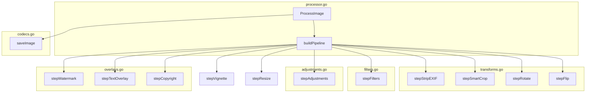
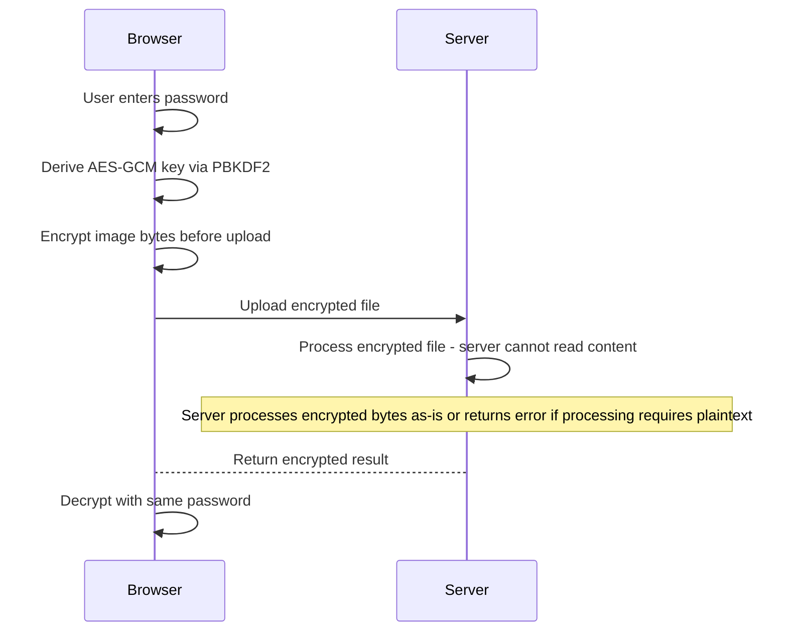
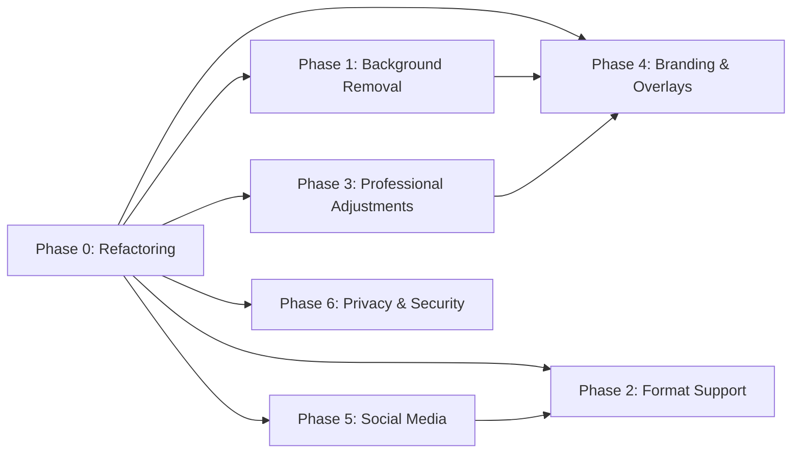

# Image Resizer — Feature Expansion Plan

> **Document version:** 1.0  
> **Date:** 2026-06-10  
> **Status:** Draft — Pending Approval

---

## Table of Contents

1. [Current Architecture](#current-architecture)
2. [Phase 0 — Structural Refactoring](#phase-0--structural-refactoring)
3. [Phase 1 — Background Removal](#phase-1--background-removal)
4. [Phase 2 — Format Support & Encoding](#phase-2--format-support--encoding)
5. [Phase 3 — Professional Adjustments](#phase-3--professional-adjustments)
6. [Phase 4 — Branding & Overlays](#phase-4--branding--overlays)
7. [Phase 5 — Social Media Optimization](#phase-5--social-media-optimization)
8. [Phase 6 — Privacy, Security & Ethics](#phase-6--privacy-security--ethics)
9. [Implementation Priority Order](#implementation-priority-order)
10. [Frontend Architecture Changes](#frontend-architecture-changes)
11. [API Versioning Strategy](#api-versioning-strategy)
12. [Risk Assessment](#risk-assessment)

---

## Current Architecture

### Stack

| Layer | Technology | Key Files |
|-------|-----------|-----------|
| Backend | Go 1.26.4 + Gin v1.12 | [`cmd/server/main.go`](cmd/server/main.go), [`internal/server/server.go`](internal/server/server.go:1) |
| Processing | `disintegration/imaging` + custom pixel math | [`internal/processor/processor.go`](internal/processor/processor.go:1) (558 lines) |
| Config | Environment-variable-based | [`internal/config/config.go`](internal/config/config.go:1) |
| Frontend | Vanilla JS + HTML + custom CSS | [`web/static/js/app.js`](web/static/js/app.js:1) (234 lines), [`web/templates/index.html`](web/templates/index.html:1) (244 lines), [`web/static/css/style.css`](web/static/css/style.css:1) (509 lines) |
| Container | Alpine-based Docker | [`dockerfile`](dockerfile:1) |

### Current Dependencies

| Dependency | Purpose |
|-----------|---------|
| `disintegration/imaging` v1.6.2 | Core resize, filters, encoding |
| `chai2010/webp` v1.4.0 | WebP encode/decode |
| `sergeymakinen/go-ico` v1.0.0 | ICO encode |
| `golang/freetype` | Text rendering |
| `jung-kurt/gofpdf` v1.16.2 | PDF generation |
| `gin-gonic/gin` v1.12.0 | HTTP framework |
| `golang.org/x/image` v0.42.0 | Extended image codecs |

### Current `ProcessOptions` Struct

Defined at [`internal/processor/processor.go:62`](internal/processor/processor.go:62):

```go
type ProcessOptions struct {
    Operation      string
    Percentage     int
    Width          int
    Height         int
    Quality        int
    Method         string
    Format         string
    Rotation       int      // 0, 90, 180, 270
    Flip           string   // "h", "v", "both", ""
    Filters        []string // "grayscale", "sepia", "invert", "blur", "sharpen", "pixelate", "noir", "vivid"
    WatermarkPath  string
    WatermarkPos   string   // "center", "top-left", etc.
    TextOverlay    string
    TextColor      string   // hex
    TextSize       float64
    StripEXIF      bool
    Copyright      string
    Brightness     float64  // -100 to 100
    Contrast       float64  // -100 to 100
    Saturation     float64  // -100 to 100
    Pixelate       int      // 0 (off) to 100
    Crop           string   // "1:1", "16:9", "4:3", "none"
    Vignette       bool
    RenameTemplate string
}
```

### Current Processing Pipeline

Defined in [`ProcessImage()`](internal/processor/processor.go:213):

```
EXIF Strip → Smart Crop → Rotation → Flip → Filters → Adjustments → Vignette → Resize → Watermark → Text Overlay → Copyright → Save
```

### Current Server Routes

Defined in [`setupRoutes()`](internal/server/server.go:51):

| Route | Method | Handler |
|-------|--------|---------|
| `/` | GET | `handleIndex` |
| `/` | POST | `handleUpload` |
| `/download/:filename` | GET | `handleDownload` |
| `/download-all` | GET | `handleDownloadAll` |
| `/api/v1/process` | POST | `handleUpload` (shared) |
| `/api/v1/status` | GET | Inline health check |

### Key Architectural Problems

1. **Monolithic processor** — All 558 lines of processing logic in a single file
2. **Monolithic server** — Routes, handlers, cleanup, and lifecycle in one 375-line file
3. **No pipeline abstraction** — Hard-coded sequential steps in `ProcessImage()`
4. **No testability** — Cannot unit-test individual steps in isolation
5. **Frontend coupling** — Social presets hardcoded in HTML, not accessible via API

---

## Phase 0 — Structural Refactoring

> **Prerequisite:** This phase MUST be completed before any other phase. It enables all subsequent work by making the codebase modular and testable.

### Goal

Split the monolithic [`processor.go`](internal/processor/processor.go:1) and [`server.go`](internal/server/server.go:1) into focused, single-responsibility files, and introduce a composable pipeline pattern.

### Processor File Split

| New File | Contents | Lines (est.) |
|----------|----------|-------------|
| [`processor.go`](internal/processor/processor.go:1) | `ProcessOptions`, `ProcessResult`, `ProcessImage()` orchestrator, `PipelineStep` type, `IsAllowedImageFile()`, `clampUint8()`, `parseHexColor()`, `getPlatformFontPath()` | ~120 |
| `filters.go` | `applySepia()`, `applyVignette()`, plus all future artistic filters | ~80 |
| `adjustments.go` | Brightness, contrast, saturation wrappers + future HSL/curves/levels | ~60 |
| `overlays.go` | Watermark overlay, text overlay, copyright text + future QR/shadow/border | ~120 |
| `codecs.go` | `AllowedExtensions`, format-specific encoding/decoding (WebP, ICO, JPEG, PNG, GIF, TIFF, PDF), `CreatePDF()` | ~100 |
| `transforms.go` | Crop, rotate, flip operations | ~60 |
| `background.go` | Background removal (new, for Phase 1) | ~80 |

### Server File Split

| New File | Contents | Lines (est.) |
|----------|----------|-------------|
| [`server.go`](internal/server/server.go:1) | `Server` struct, `NewServer()`, `setupRoutes()`, `Start()`, `Shutdown()`, `startCleanupWorker()`, `cleanupFiles()` | ~100 |
| `handlers.go` | `handleIndex()`, `handleUpload()`, `handleDownload()`, `handleDownloadAll()` + all future handlers | ~280 |

### Composable Pipeline Pattern

Introduce a `PipelineStep` function type that allows each processing step to be a self-contained, testable unit:

```go
// PipelineStep is a composable image processing step.
// It receives the current image and options, and returns the transformed image.
type PipelineStep func(image.Image, *ProcessOptions) (image.Image, error)
```

The refactored `ProcessImage()` will build and execute a pipeline dynamically:

```go
func ProcessImage(srcPath, destDir string, opts *ProcessOptions) (*ProcessResult, error) {
    img, err := imaging.Open(srcPath, imaging.AutoOrientation(true))
    if err != nil {
        return nil, fmt.Errorf("failed to open image: %w", err)
    }

    pipeline := buildPipeline(opts)
    for _, step := range pipeline {
        img, err = step(img, opts)
        if err != nil {
            return nil, fmt.Errorf("pipeline step failed: %w", err)
        }
    }

    return saveImage(img, srcPath, destDir, opts)
}

func buildPipeline(opts *ProcessOptions) []PipelineStep {
    var steps []PipelineStep

    if opts.StripEXIF {
        steps = append(steps, stepStripEXIF)
    }
    if opts.Crop != "" && opts.Crop != "none" {
        steps = append(steps, stepSmartCrop)
    }
    steps = append(steps, stepRotate, stepFlip)
    steps = append(steps, stepFilters)
    steps = append(steps, stepAdjustments)
    if opts.Vignette {
        steps = append(steps, stepVignette)
    }
    steps = append(steps, stepResize)
    if opts.WatermarkPath != "" {
        steps = append(steps, stepWatermark)
    }
    if opts.TextOverlay != "" {
        steps = append(steps, stepTextOverlay)
    }
    if opts.Copyright != "" {
        steps = append(steps, stepCopyright)
    }

    return steps
}
```

### Phase 0 Deliverables

- [ ] Split [`processor.go`](internal/processor/processor.go:1) into 7 files
- [ ] Split [`server.go`](internal/server/server.go:1) into 2 files
- [ ] Implement `PipelineStep` type and `buildPipeline()` function
- [ ] Refactor `ProcessImage()` to use pipeline pattern
- [ ] All existing tests pass (no behavioral changes)
- [ ] Add unit tests for each extracted step

### Phase 0 Architecture Diagram



---

## Phase 1 — Background Removal

### Goal

Add background removal capabilities with three methods: transparent, flood-fill, and color-match.

### New `ProcessOptions` Fields

```go
RemoveBackground   bool   // Enable background removal
BgRemovalTolerance int    // 0-100, color distance tolerance
BgRemovalMethod    string // "transparent", "flood-fill", "color-match"
BgRemovalColor     string // Hex color for color-match method
```

### Feature Breakdown

#### 1. Transparent Background Removal

- Detect fully transparent pixels (alpha = 0) and optionally replace with a chosen color
- For PNG/WebP output, keep transparency as-is
- For JPEG output (no alpha channel), replace transparent pixels with white or user-chosen color

#### 2. Flood-Fill Background Removal

- Start from image corners/edges
- Use BFS flood-fill algorithm to find connected same-color regions
- Tolerance slider controls how similar a pixel must be to continue the flood
- Euclidean distance in RGB space: `sqrt((r1-r2)^2 + (g1-g2)^2 + (b1-b2)^2)`
- Tolerance 0 = exact match only; tolerance 100 = remove everything

#### 3. Color-Match Background Removal

- User picks a specific hex color
- All pixels within tolerance of that color become transparent
- Useful for solid-color studio backgrounds (white, green screen, etc.)

#### 4. Edge Detection for Smart Boundary Finding

- Sobel operator for edge detection
- Used internally to refine flood-fill boundaries
- Prevents "eating into" the subject when tolerance is high

### Implementation Approach

All implemented in pure Go using `image.NRGBA` pixel iteration — no CGO required.

```go
// background.go

func stepRemoveBackground(img image.Image, opts *ProcessOptions) (image.Image, error) {
    if !opts.RemoveBackground {
        return img, nil
    }

    switch opts.BgRemovalMethod {
    case "transparent":
        return removeTransparentBg(img, opts)
    case "flood-fill":
        return removeFloodFillBg(img, opts)
    case "color-match":
        return removeColorMatchBg(img, opts)
    default:
        return removeFloodFillBg(img, opts)
    }
}

// colorDistance computes Euclidean distance between two colors in RGB space.
func colorDistance(r1, g1, b1, r2, g2, b2 uint8) float64 {
    dr := float64(r1) - float64(r2)
    dg := float64(g1) - float64(g2)
    db := float64(b1) - float64(b2)
    return math.Sqrt(dr*dr + dg*dg + db*db)
}

// floodFillFromCorners performs BFS from all four corners simultaneously.
func floodFillFromCorners(img *image.NRGBA, tolerance int) map[image.Point]bool {
    // ... BFS implementation
}
```

### Pipeline Integration

Background removal runs **after** EXIF strip but **before** crop/rotation, since it needs the full original pixel data:

```
EXIF Strip → Background Removal → Smart Crop → Rotation → Flip → ...
```

### UI Changes

New "Background Removal" section in [`index.html`](web/templates/index.html:1):

- Toggle switch: Enable/disable
- Method selector: Transparent / Flood-Fill / Color-Match
- Tolerance slider: 0–100 (shown for flood-fill and color-match)
- Color picker: Hex input (shown for color-match only)
- Dynamic show/hide based on method selection

### Phase 1 Deliverables

- [ ] Create `background.go` with all three removal methods
- [ ] Add `stepRemoveBackground` to pipeline
- [ ] Add new `ProcessOptions` fields
- [ ] Parse new fields in [`handleUpload()`](internal/server/server.go:149)
- [ ] Add UI controls in [`index.html`](web/templates/index.html:1)
- [ ] Wire UI controls in [`app.js`](web/static/js/app.js:1)
- [ ] Unit tests for each removal method
- [ ] Integration test with sample images

---

## Phase 2 — Format Support & Encoding

### Goal

Expand format support from 8 input types to 15+, add advanced encoding options, and support animated formats.

### Feature Table

| # | Feature | Approach | New Dependency | CGO Required |
|---|---------|----------|----------------|-------------|
| 26 | AVIF Support | `github.com/Kagami/go-avif` with libaom | go-avif + libaom | Yes |
| 27 | HEIC/HEIF Decoding | `github.com/go-xmlpath/go-heif` or shell out to `heif-convert` | libheif | Yes |
| 28 | JPEG XL Support | Shell out to `cjxl`/`djxl` binaries | libjxl binaries | No (shell) |
| 29 | SVG Rasterization | `github.com/srwiley/oksvg` for SVG input parsing | oksvg | No |
| 30 | ICO Multi-size Bundler | Extend existing `go-ico` to bundle multiple sizes | existing go-ico | No |
| 31 | Animated WebP/GIF | Frame-aware pipeline: decode all frames, process each, re-encode | custom frame handling | No |
| 32 | RAW File Support | `github.com/ncruces/go-dng` or shell out to `dcraw` | go-dng or dcraw | Optional |
| 33 | Base64 Export | Encode output as base64 string in JSON response | stdlib `encoding/base64` | No |
| 34 | Progressive JPEG | `image/jpeg` with progressive encoder option | stdlib | No |
| 35 | TIFF Multi-page | `golang.org/x/image/tiff` multi-frame decode | existing golang.org/x/image | No |
| 36 | PDF-to-Image | Shell out to `pdftoppm` or use `github.com/ledongthuc/pdf` | pdf library | No (shell) |
| 37 | HDR-to-SDR Tone Mapping | Custom Reinhard/Hable tone mapping on 16-bit images | custom pixel math | No |
| 38 | Web Manifest Generator | Generate `manifest.json` with icon sizes | stdlib `encoding/json` | No |
| 39 | Lossless WebP Optimization | `chai2010/webp` with quality=100 and method=6 | existing webp lib | No |
| 40 | DICOM Support | `github.com/grailbio/go-dicom` for decode | go-dicom | No |

### New `ProcessOptions` Fields

```go
ProgressiveJPEG  bool     // Encode JPEG as progressive
Base64Output     bool     // Return base64 in JSON instead of file
ICOSizes         []int    // Sizes for ICO bundler: 16, 32, 48, 64, 128, 256
ManifestGenerate bool     // Generate web manifest.json
LosslessWebP     bool     // Force lossless WebP encoding
ToneMapHDR       bool     // Apply HDR-to-SDR tone mapping
```

### New `AllowedExtensions` Entries

```go
".avif": true,
".heic": true,
".heif": true,
".jxl":  true,
".svg":  true,
".raw":  true,
".dng":  true,
".dcm":  true,
".pdf":  true,  // input (already supported as output)
```

### Animated Format Handling

The current pipeline processes a single `image.Image`. For animated formats (GIF, animated WebP), we need a frame-aware pipeline:

```go
// AnimatedImage holds multiple frames with timing information.
type AnimatedImage struct {
    Frames []image.Image
    Delays []int  // Delay per frame in 100ths of a second
    LoopCount int // 0 = infinite
}

// ProcessAnimated applies the pipeline to each frame independently.
func ProcessAnimated(anim *AnimatedImage, opts *ProcessOptions) (*AnimatedImage, error) {
    result := &AnimatedImage{LoopCount: anim.LoopCount}
    for i, frame := range anim.Frames {
        processed, err := processSingleFrame(frame, opts)
        if err != nil {
            return nil, err
        }
        result.Frames = append(result.Frames, processed)
        result.Delays = append(result.Delays, anim.Delays[i])
    }
    return result, nil
}
```

### ICO Multi-size Bundler

Extend the existing ICO encoding at [`processor.go:533`](internal/processor/processor.go:533) to generate multiple sizes:

```go
func encodeICOBundle(img image.Image, sizes []int, destPath string) error {
    // Resize source image to each specified size
    // Bundle all sizes into a single .ico file using go-ico
}
```

### Docker Changes

The [`dockerfile`](dockerfile:1) needs additional system libraries for CGO-dependent formats:

```dockerfile
# Build stage - add format libraries
RUN apk add --no-cache gcc musl-dev libaom-dev libheif-dev libjxl-dev libraw-dev dcraw poppler-utils

# Final stage - add runtime libraries
RUN apk add --no-cache ttf-dejavu ca-certificates libaom libheif libjxl libraw poppler-utils
```

> **Note:** Some of these libraries may not be available in Alpine packages. Fallback approaches:
> - Use Debian-based images for broader library support
> - Shell out to CLI tools (`cjxl`, `djxl`, `heif-convert`, `pdftoppm`, `dcraw`) as an alternative to CGO
> - Make CGO features opt-in via build tags

### Build Tag Strategy

To keep the core build lightweight, CGO-dependent features should use Go build tags:

```go
// codec_avif.go
//go:build cgo && avif

package processor

func init() {
    registerCodec("avif", encodeAVIF, decodeAVIF)
}
```

```go
// codec_avif_stub.go
//go:build !cgo || !avif

package processor

func init() {
    registerCodec("avif", nil, nil) // Will return "not supported" error
}
```

### Phase 2 Deliverables

- [ ] Add AVIF encoding/decoding with build tags
- [ ] Add HEIC/HEIF decoding with build tags
- [ ] Add JPEG XL support via shell-out
- [ ] Add SVG rasterization input support
- [ ] Extend ICO to multi-size bundler
- [ ] Implement animated GIF/WebP frame pipeline
- [ ] Add RAW file input support
- [ ] Add Base64 export option
- [ ] Add Progressive JPEG encoding
- [ ] Add TIFF multi-page decoding
- [ ] Add PDF-to-image conversion
- [ ] Implement HDR-to-SDR tone mapping
- [ ] Add Web Manifest generator
- [ ] Add Lossless WebP optimization
- [ ] Add DICOM input support
- [ ] Update Dockerfile with new dependencies
- [ ] Update `AllowedExtensions` map
- [ ] Add format options to UI
- [ ] Unit tests for each new codec

---

## Phase 3 — Professional Adjustments

### Goal

Add professional-grade image adjustment tools — HSL, curves, levels, selective color, and advanced sharpening/noise features. All pure Go, no CGO required.

### Feature Table

| # | Feature | Approach |
|---|---------|----------|
| 41 | HSL Sliders | Custom RGB→HSL→RGB conversion with per-channel adjustment |
| 42 | Curves Adjustment | Cubic spline interpolation with control points per channel |
| 43 | Levels Histogram | Black point, white point, gamma with visual histogram |
| 44 | Selective Color | Per-hue-range CMYK adjustment |
| 45 | Chromatic Aberration Fix | Scale R/B channels inward from center |
| 46 | Unsharp Mask | Gaussian blur + difference: USM = original + amount * (original - blur) |
| 47 | Film Grain Simulation | Add Gaussian-distributed random noise per channel |
| 48 | Temperature & Tint | RGB channel scaling (warm=+R-B, cool=+B-R) + green/magenta tint |
| 49 | Shadow/Highlight Recovery | Luminance-based mask with local adjustment |
| 50 | Vignette Customization | Extend existing vignette with feathering, roundness, midpoint |

### New `ProcessOptions` Fields

```go
// HSL adjustments
Hue        float64 // -180 to 180
Lightness  float64 // -100 to 100 (separate from existing Brightness)

// Curves
CurvesPoints string // JSON: {"r":[[0,0],[64,58],[192,196],[255,255]],"g":...,"b":...,"rgb":...}

// Levels
LevelsBlack float64 // 0-255
LevelsWhite float64 // 0-255
LevelsGamma float64 // 0.1-10.0

// Selective Color
SelectiveColor string // JSON: {"reds":{"cyan":-10,"magenta":5,...},"blues":{...}}

// Chromatic Aberration
ChromaticAberration float64 // -10 to 10 (pixel offset for R/B channels)

// Unsharp Mask
UnsharpAmount float64 // 0-500 (percentage)
UnsharpRadius float64 // 0.1-10.0 (pixels)

// Film Grain
GrainAmount float64 // 0-100

// Temperature & Tint
Temperature float64 // -100 (cool) to 100 (warm)
Tint        float64 // -100 (magenta) to 100 (green)

// Shadow/Highlight Recovery
ShadowRecovery    float64 // 0-100
HighlightRecovery float64 // 0-100

// Vignette Customization (extends existing bool Vignette)
VignetteFeather   float64 // 0-100
VignetteRoundness float64 // 0-100
VignetteMidpoint  float64 // 0-100
```

### Implementation Details

#### HSL Conversion

```go
// adjustments.go

// rgbToHsl converts RGB (0-255) to HSL (0-360, 0-100, 0-100).
func rgbToHsl(r, g, b uint8) (float64, float64, float64) { ... }

// hslToRgb converts HSL back to RGB.
func hslToRgb(h, s, l float64) (uint8, uint8, uint8) { ... }

func stepHSL(img image.Image, opts *ProcessOptions) (image.Image, error) {
    if opts.Hue == 0 && opts.Lightness == 0 {
        return img, nil
    }
    // Iterate pixels, convert to HSL, adjust, convert back
}
```

#### Curves Adjustment

Cubic spline interpolation through user-defined control points:

```go
type CurvePoint struct {
    In  float64 // 0-255 input
    Out float64 // 0-255 output
}

// buildCurveLUT builds a 256-entry lookup table from control points
// using cubic spline interpolation.
func buildCurveLUT(points []CurvePoint) [256]uint8 { ... }
```

#### Unsharp Mask

```go
func stepUnsharpMask(img image.Image, opts *ProcessOptions) (image.Image, error) {
    if opts.UnsharpAmount == 0 {
        return img, nil
    }
    // 1. Create blurred version (Gaussian blur with given radius)
    blurred := imaging.Blur(img, opts.UnsharpRadius)
    // 2. USM = original + amount * (original - blurred)
    // 3. Iterate pixels and compute
}
```

#### Temperature & Tint

```go
func stepTemperature(img image.Image, opts *ProcessOptions) (image.Image, error) {
    if opts.Temperature == 0 && opts.Tint == 0 {
        return img, nil
    }
    // Warm: increase R, decrease B
    // Cool: increase B, decrease R
    // Tint: adjust G channel (green vs magenta)
    // Use channel scaling multipliers
}
```

### Pipeline Integration

Professional adjustments slot in after basic adjustments but before vignette:

```
... → Filters → Basic Adjustments → HSL → Curves → Levels → Selective Color → Temperature/Tint → Shadow/Highlight → Chromatic Aberration → Unsharp Mask → Film Grain → Vignette → Resize → ...
```

### UI Changes

New collapsible sections in the controls panel:

- **Color** section: HSL sliders, Temperature, Tint
- **Tone** section: Curves editor (visual), Levels with histogram
- **Detail** section: Unsharp Mask, Film Grain, Chromatic Aberration
- **Vignette** section: Expand existing toggle into full controls

The Curves editor requires a custom canvas-based UI component for dragging control points on a grid.

### Phase 3 Deliverables

- [ ] Implement HSL conversion and adjustment step
- [ ] Implement Curves adjustment with spline interpolation
- [ ] Implement Levels adjustment with black/white/gamma
- [ ] Implement Selective Color adjustment
- [ ] Implement Chromatic Aberration fix
- [ ] Implement Unsharp Mask
- [ ] Implement Film Grain simulation
- [ ] Implement Temperature & Tint
- [ ] Implement Shadow/Highlight Recovery
- [ ] Extend Vignette with feathering, roundness, midpoint
- [ ] Add all new `ProcessOptions` fields
- [ ] Parse new fields in server handler
- [ ] Add UI sections with sliders and controls
- [ ] Build Curves visual editor component
- [ ] Build Levels histogram display
- [ ] Unit tests for each adjustment

---

## Phase 4 — Branding & Overlays

### Goal

Add professional branding, watermark, and overlay features for content creators and businesses.

### Feature Table

| # | Feature | Approach |
|---|---------|----------|
| 51 | Dynamic Text Watermarks | Template variables: `{filename}`, `{date}`, `{time}`, `{year}`, `{camera}` (from EXIF) |
| 52 | Tiled Watermarks | Loop overlay placement across image with configurable spacing |
| 53 | QR Code Overlay | `github.com/skip2/go-qrcode` — generate and overlay |
| 54 | Barcode Generator | `github.com/boombuler/barcode` — Code128, EAN-13 |
| 55 | Rounded Corners | Draw rounded rect mask, apply alpha |
| 56 | Drop Shadows | Expand canvas, draw offset blurred shadow rectangle |
| 57 | Stroke/Border | Canvas expansion + fill rect (solid, dashed, gradient) |
| 58 | Placeholder Generator | Generate solid-color images with dimension text |
| 59 | Invisible Steganography | LSB encoding in pixel data for hidden messages |
| 60 | Signature Stamp | Upload PNG, overlay at specified position with opacity |

### New `ProcessOptions` Fields

```go
// Dynamic Text Watermarks
WatermarkTemplate   string  // e.g. "{filename} - {year}"
WatermarkTile       bool    // Tile watermark across image
WatermarkTileSpacing int    // Pixels between tiled watermarks
WatermarkOpacity    float64 // 0.0-1.0

// QR Code
QRCodeText string // Text/URL to encode
QRCodeSize int    // Output size in pixels

// Barcode
BarcodeText string // Data to encode
BarcodeType string // "code128", "ean13"

// Rounded Corners
RoundedCorners int // Radius in pixels

// Drop Shadow
DropShadowOffset int     // Shadow offset in pixels
DropShadowBlur   float64 // Blur radius
DropShadowColor  string  // Hex color

// Border/Stroke
BorderWidth  int    // Width in pixels
BorderColor  string // Hex color
BorderStyle  string // "solid", "dashed", "gradient"

// Placeholder
PlaceholderText string // Text to center on placeholder

// Steganography
SteganographyText string // Hidden message to encode

// Signature
SignaturePath     string // Path to uploaded PNG signature
SignaturePosition string // "bottom-right", "bottom-left", etc.
```

### New Dependencies

| Dependency | Purpose |
|-----------|---------|
| `github.com/skip2/go-qrcode` | QR code generation |
| `github.com/boombuler/barcode` | Barcode generation (Code128, EAN-13) |

### Implementation Details

#### Dynamic Text Watermarks

Expand the existing text overlay system at [`processor.go:400`](internal/processor/processor.go:400) to support template variables:

```go
var watermarkTemplateVars = map[string]func(string) string{
    "{filename}": func(srcPath string) string { return filepath.Base(srcPath) },
    "{date}":     func(_ string) string { return time.Now().Format("2006-01-02") },
    "{time}":     func(_ string) string { return time.Now().Format("15:04:05") },
    "{year}":     func(_ string) string { return time.Now().Format("2006") },
    "{camera}":   func(srcPath string) string { /* read EXIF camera model */ },
}

func resolveWatermarkTemplate(tmpl string, srcPath string) string {
    for varName, resolver := range watermarkTemplateVars {
        tmpl = strings.ReplaceAll(tmpl, varName, resolver(srcPath))
    }
    return tmpl
}
```

#### Tiled Watermarks

```go
func applyTiledWatermark(dst *image.NRGBA, wm image.Image, spacing int, opacity float64) {
    bounds := dst.Bounds()
    wmBounds := wm.Bounds()
    for y := bounds.Min.Y; y < bounds.Max.Y; y += wmBounds.Dy() + spacing {
        for x := bounds.Min.X; x < bounds.Max.X; x += wmBounds.Dx() + spacing {
            drawWithOpacity(dst, wm, image.Pt(x, y), opacity)
        }
    }
}
```

#### Steganography (LSB Encoding)

```go
func encodeSteganography(img image.Image, message string) image.Image {
    // Encode message length + message into least-significant bits
    // of R, G, B channels across all pixels
    // Format: [4 bytes length][message bytes][padding]
}

func decodeSteganography(img image.Image) string {
    // Read LSBs to reconstruct hidden message
}
```

#### Drop Shadows

```go
func applyDropShadow(img image.Image, offset int, blur float64, shadowColor color.RGBA) image.Image {
    // 1. Calculate new canvas size (original + offset + blur padding)
    // 2. Create shadow rectangle at offset position
    // 3. Apply Gaussian blur to shadow
    // 4. Composite original image on top
}
```

### Pipeline Integration

Branding/overlay steps run **after** resize but before save:

```
... → Resize → Rounded Corners → Drop Shadow → Border → Tiled Watermark → QR/Barcode Overlay → Signature → Dynamic Text → Steganography → Save
```

### Phase 4 Deliverables

- [ ] Implement dynamic text watermark templates
- [ ] Implement tiled watermark overlay
- [ ] Add QR code generation and overlay
- [ ] Add barcode generation and overlay
- [ ] Implement rounded corners mask
- [ ] Implement drop shadow effect
- [ ] Implement border/stroke with styles
- [ ] Implement placeholder image generator
- [ ] Implement LSB steganography encoding
- [ ] Implement signature stamp overlay
- [ ] Add all new `ProcessOptions` fields
- [ ] Parse new fields in server handler
- [ ] Add UI controls for all overlay features
- [ ] Add steganography decode endpoint
- [ ] Unit tests for each overlay feature

---

## Phase 5 — Social Media Optimization

### Goal

Add platform-specific presets, multi-output generators, and smart sizing for social media and app stores.

### Feature Table

| # | Feature | Approach |
|---|---------|----------|
| 81 | Instagram Carousel Slicer | Split wide image into N slides of 1080×1350 |
| 82 | YouTube Thumbnail Safe-Zone | Overlay guide zones, auto-position text |
| 83 | Discord Emoji Optimizer | Resize to fit 256KB limit with quality reduction loop |
| 84 | App Store Screenshot Mockups | Overlay image inside device frame PNG |
| 85 | LinkedIn Banner Preset | 1584×396 with safe zone guides |
| 86 | Twitter/X Header Optimization | 1500×500 with profile pic overlap zone |
| 87 | Slack Emoji Auto-Resize | Force 128×128 |
| 88 | Pinterest Long-Pin Stitcher | Combine N images vertically into 1000×N format |
| 89 | Favicon Generator | Generate all sizes: 16, 32, 48, 64, 128, 180, 192, 256, 384, 512 |
| 90 | Twitch Panel Templates | Preset sizes for panels |

### New `ProcessOptions` Fields

```go
CarouselSlice      bool   // Enable carousel slicing
CarouselSliceWidth  int    // Slide width (default 1080)
CarouselSliceHeight int    // Slide height (default 1350)
SafeZoneOverlay    bool   // Draw safe zone guides
MaxFileSize        int    // Max file size in KB (for Discord emoji)
DeviceFramePath    string // Path to device frame PNG
StitchImages       bool   // Stitch multiple images vertically
FaviconGenerate    bool   // Generate all favicon sizes
```

### Backend Social Presets

Move social presets from hardcoded HTML in [`index.html:48`](web/templates/index.html:48) to a Go config structure accessible via API:

```go
// internal/config/presets.go

type SocialPreset struct {
    Name       string `json:"name"`
    Width      int    `json:"width"`
    Height     int    `json:"height"`
    Operation  string `json:"operation"` // "fill" or "resize"
    Category   string `json:"category"`  // "instagram", "youtube", etc.
    SafeZones  []SafeZone `json:"safeZones,omitempty"`
}

type SafeZone struct {
    X      int `json:"x"`
    Y      int `json:"y"`
    Width  int `json:"width"`
    Height int `json:"height"`
    Label  string `json:"label"`
}

var SocialPresets = []SocialPreset{
    {Name: "Instagram Post", Width: 1080, Height: 1080, Operation: "fill", Category: "instagram"},
    {Name: "Instagram Portrait", Width: 1080, Height: 1350, Operation: "fill", Category: "instagram"},
    {Name: "Instagram Story", Width: 1080, Height: 1920, Operation: "fill", Category: "instagram"},
    {Name: "YouTube Thumbnail", Width: 1920, Height: 1080, Operation: "fill", Category: "youtube",
        SafeZones: []SafeZone{{X: 0, Y: 0, Width: 1920, Height: 360, Label: "Title Area"}}},
    {Name: "LinkedIn Banner", Width: 1584, Height: 396, Operation: "resize", Category: "linkedin",
        SafeZones: []SafeZone{{X: 540, Y: 0, Width: 504, Height: 396, Label: "Profile Pic Overlap"}}},
    // ... more presets
}
```

New API endpoint:

```
GET /api/v1/presets → returns SocialPresets as JSON
```

### Key Implementation: Instagram Carousel Slicer

```go
func sliceCarousel(img image.Image, slideW, slideH int) []image.Image {
    bounds := img.Bounds()
    var slides []image.Image
    for x := bounds.Min.X; x < bounds.Max.X; x += slideW {
        // Crop each slide from the wide image
        slideBounds := image.Rect(x, 0, x+slideW, slideH)
        if slideBounds.Max.X > bounds.Max.X {
            slideBounds.Max.X = bounds.Max.X
        }
        slide := imaging.Crop(img, slideBounds)
        slides = append(slides, slide)
    }
    return slides
}
```

### Key Implementation: Discord Emoji Optimizer

```go
func optimizeForFileSize(img image.Image, maxKB int, format string) image.Image {
    quality := 85
    for quality >= 10 {
        buf := &bytes.Buffer{}
        encodeToBuffer(img, buf, format, quality)
        if buf.Len() <= maxKB*1024 {
            return img
        }
        // Reduce quality and try again
        quality -= 5
    }
    // If still too large, reduce dimensions
    // ...
}
```

### Key Implementation: Favicon Generator

```go
func generateFavicons(img image.Image) map[int][]byte {
    sizes := []int{16, 32, 48, 64, 128, 180, 192, 256, 384, 512}
    results := make(map[int][]byte)
    for _, size := range sizes {
        resized := imaging.Resize(img, size, size, imaging.Lanczos)
        buf := &bytes.Buffer{}
        png.Encode(buf, resized)
        results[size] = buf.Bytes()
    }
    return results
}
```

### Multi-Output Handling

Some features (carousel slicer, favicon generator) produce multiple output files from a single input. The server handler and result format need to support this:

```go
type ProcessResult struct {
    OriginalName string   `json:"originalName"`
    ProcessedName string  `json:"processedName"`
    OriginalSize  string  `json:"originalSize"`
    NewSize       string  `json:"newSize"`
    NewFilePath   string  `json:"newFilePath"`
    ExtraFiles    []string `json:"extraFiles,omitempty"` // For multi-output
    Error         string   `json:"error,omitempty"`
}
```

### Phase 5 Deliverables

- [ ] Create `internal/config/presets.go` with all social presets
- [ ] Add `GET /api/v1/presets` endpoint
- [ ] Implement Instagram Carousel Slicer
- [ ] Implement YouTube Thumbnail Safe-Zone overlay
- [ ] Implement Discord Emoji Optimizer (file size targeting)
- [ ] Implement App Store Screenshot Mockups
- [ ] Implement LinkedIn Banner preset with safe zones
- [ ] Implement Twitter/X Header with overlap zone
- [ ] Implement Slack Emoji Auto-Resize
- [ ] Implement Pinterest Long-Pin Stitcher
- [ ] Implement Favicon Generator (all sizes)
- [ ] Implement Twitch Panel Templates
- [ ] Update `ProcessResult` for multi-output
- [ ] Update frontend to load presets from API
- [ ] Add UI for carousel slicing, favicon generation, etc.
- [ ] Unit tests for each feature

---

## Phase 6 — Privacy, Security & Ethics

### Goal

Add privacy-first processing modes, secure sharing, and client-side encryption.

### Feature Table

| # | Feature | Approach |
|---|---------|----------|
| 96 | Zero-Log Mode | Process entirely in memory, no disk writes, no temp files |
| 99 | Private Link Sharing | Generate signed URL tokens with expiry (24h default) |
| 100 | Local-First Encryption | AES-GCM encryption in browser before upload, server never sees plaintext |

### New `ProcessOptions` Fields

```go
ZeroLog            bool   // Process in memory only
EncryptOutput      bool   // Encrypt output file
EncryptionPassword string // Password for encryption
```

### New Server Features

#### Zero-Log Mode

When `ZeroLog` is enabled:

1. **No disk writes** — Images are processed entirely in memory using `bytes.Buffer`
2. **No temp files** — Upload goes directly to memory via `multipart.Reader`
3. **No file storage** — Output is returned directly in the HTTP response body
4. **No logging of filenames** — Server logs omit file details

```go
func (s *Server) handleUploadZeroLog(c *gin.Context) {
    // Read files into memory
    // Process using in-memory pipeline
    // Return processed image bytes directly in response
    // No files touch disk at any point
}
```

#### Private Link Sharing

Generate signed, time-limited download URLs:

```go
// internal/server/tokens.go

type DownloadToken struct {
    Filename  string    `json:"filename"`
    ExpiresAt time.Time `json:"expiresAt"`
}

func generateDownloadToken(filename string, secret string, ttl time.Duration) (string, error) {
    token := DownloadToken{
        Filename:  filename,
        ExpiresAt: time.Now().Add(ttl),
    }
    // JSON encode → encrypt with AES-GCM using server secret → base64url encode
    // Return as URL-safe string
}

func validateDownloadToken(tokenStr string, secret string) (*DownloadToken, error) {
    // base64url decode → AES-GCM decrypt → JSON decode → check expiry
}
```

New route:

```
GET /download/:token → validate token → serve file or 403
```

New `Config` fields:

```go
TokenSecret string // HMAC/AES secret for token signing
TokenTTL    time.Duration // Default 24h
```

#### Local-First Encryption

Client-side encryption flow:



> **Important limitation:** Server-side processing (resize, filters, etc.) requires access to plaintext pixel data. For encrypted uploads, the server can only:
> 1. Store the encrypted file as-is (no processing)
> 2. Return the encrypted file for client-side processing
>
> A practical approach: encrypt only the **output** (server processes normally, then encrypts the result before sending). True client-side encryption would require a WebAssembly-based processor in the browser.

**Revised approach for Phase 6:**

- **At-rest encryption:** Server processes normally, encrypts the output file, returns encrypted bytes. Client decrypts with password.
- **Client-side encryption for storage:** Browser encrypts before upload, server stores encrypted file without processing, client downloads and decrypts for local processing.

### Phase 6 Deliverables

- [ ] Implement in-memory processing pipeline (zero-log mode)
- [ ] Add `handleUploadZeroLog` handler
- [ ] Implement signed download token system
- [ ] Add `generateDownloadToken()` and `validateDownloadToken()`
- [ ] Add token-based download route
- [ ] Add `TokenSecret` and `TokenTTL` to config
- [ ] Implement output encryption (AES-GCM with password)
- [ ] Add Web Crypto API client-side encryption/decryption
- [ ] Add UI for zero-log toggle, private links, encryption
- [ ] Security audit of token system
- [ ] Unit tests for all security features

---

## Implementation Priority Order

The phases are ordered by dependency chain and risk mitigation:

| Priority | Phase | Rationale |
|----------|-------|-----------|
| 1 | **Phase 0** — Structural Refactoring | MUST be first. Enables all other phases by making code modular and testable. |
| 2 | **Phase 1** — Background Removal | User's primary request. Pure Go, no CGO, self-contained. |
| 3 | **Phase 3** — Professional Adjustments | Pure Go, no CGO dependencies. High value for photographers. |
| 4 | **Phase 4** — Branding & Overlays | Mostly pure Go. High value for content creators. |
| 5 | **Phase 5** — Social Media Optimization | Mostly config/presets. Low risk, high user value. |
| 6 | **Phase 2** — Format Support & Encoding | Heavy CGO dependencies, most complex, highest risk of build issues. |
| 7 | **Phase 6** — Privacy, Security & Ethics | Architectural changes (in-memory processing, token system). Best done after core features stabilize. |

### Dependency Graph



---

## Frontend Architecture Changes

### Current State

- Single [`app.js`](web/static/js/app.js:1) file (234 lines) with all logic
- Single [`index.html`](web/templates/index.html:1) with all controls inline
- Monolithic form submission with manual `FormData` construction

### Proposed JS Module Split

| Module | Responsibility |
|--------|---------------|
| `upload.js` | Drag-and-drop, file selection, file validation |
| `controls.js` | UI state management, dynamic show/hide, slider value display |
| `api.js` | HTTP client, FormData construction, response parsing |
| `results.js` | Result display, download buttons, gallery view |
| `preview.js` | Real-time preview (new — process thumbnail on server) |
| `presets.js` | Load and apply social presets from API |
| `app.js` | Entry point, module orchestration (thin) |

### UI Restructuring

The growing number of controls demands a more organized layout:

1. **Tabbed Interface** — Group controls into tabs:
   - **Resize** — Operation mode, dimensions, method, format, quality
   - **Transform** — Crop, rotation, flip
   - **Filters** — Artistic filters, pixelate
   - **Adjustments** — Brightness, contrast, saturation, HSL, temperature, curves, levels
   - **Overlays** — Watermark, text, QR, barcode, signature, border, shadow
   - **Background** — Background removal controls
   - **Social** — Platform presets, carousel, favicon
   - **Privacy** — EXIF strip, zero-log, encryption

2. **Accordion Sections** — Alternative to tabs for mobile-friendliness

3. **Dynamic Form Sections** — Show/hide based on selected features (already partially implemented for pixelate toggle)

4. **Quick Actions Toolbar** — Common one-click operations:
   - "Strip EXIF & Resize 50%"
   - "Instagram Post"
   - "Favicon Pack"
   - "WebP Optimize"

5. **Real-Time Preview** — Send a small thumbnail to the server for processing, display result inline before full processing

### CSS Considerations

The existing [`style.css`](web/static/css/style.css:1) at 509 lines will need:

- Tab/accordion component styles
- New control group styles (color pickers, curve editors, canvas overlays)
- Responsive adjustments for the expanded control panel
- Consider CSS custom properties for theming consistency

---

## API Versioning Strategy

### Current API

- Single endpoint: `POST /api/v1/process` (multipart form)
- Shared handler with web UI route `POST /`
- All parameters sent as form fields

### Backward Compatibility Approach

All new `ProcessOptions` fields are **optional** with zero-value defaults that preserve existing behavior. This means:

- **v1 API remains compatible** — New fields are simply not sent by old clients
- **No breaking changes** — Existing integrations continue to work

### Proposed v2 API

For more complex operations (curves, selective color, multi-output), a JSON request body is more appropriate:

```
POST /api/v2/process
Content-Type: application/json

{
  "files": ["<base64-encoded-image>"],
  "options": {
    "operation": "fill",
    "width": 1080,
    "height": 1080,
    "format": "webp",
    "quality": 85,
    "filters": ["grayscale"],
    "adjustments": {
      "brightness": 10,
      "hue": -15,
      "temperature": 20
    },
    "overlays": {
      "watermarkTemplate": "{filename} - {year}",
      "watermarkTile": true
    },
    "background": {
      "remove": true,
      "method": "flood-fill",
      "tolerance": 30
    }
  }
}
```

### Versioning Rules

1. `v1` API continues to work with multipart form data
2. `v2` API uses JSON request/response bodies
3. New features available in both APIs (v1 uses flat form fields, v2 uses nested JSON)
4. Deprecation notices in `v1` response headers when appropriate
5. `v1` will not be removed — it remains the simpler integration path

### New Endpoints

| Endpoint | Method | Purpose |
|----------|--------|---------|
| `GET /api/v1/presets` | GET | List all social media presets |
| `GET /api/v1/formats` | GET | List supported input/output formats |
| `POST /api/v1/steg-decode` | POST | Decode steganography from uploaded image |
| `POST /api/v2/process` | POST | JSON-based processing endpoint |
| `GET /api/v2/presets` | GET | Presets with safe zone data |
| `GET /download/:token` | GET | Token-based secure download |

---

## Risk Assessment

### High Risk

| Risk | Impact | Mitigation |
|------|--------|-----------|
| CGO dependencies in Phase 2 | Build complexity, cross-compilation issues, Alpine compatibility | Use build tags to make CGO features optional; provide shell-out fallbacks |
| Animated format processing | Memory usage with large animated GIFs/WebPs | Limit frame count; stream frames; add memory guard |
| Steganography data corruption | Hidden data lost after lossy compression | Only support PNG/WebP lossless for steganography; warn users |

### Medium Risk

| Risk | Impact | Mitigation |
|------|--------|-----------|
| `ProcessOptions` struct growth | 50+ fields becoming unwieldy | Group into sub-structs (Adjustments, Overlays, Background, etc.) |
| Frontend control panel bloat | UI becomes overwhelming | Tabbed/accordion UI; progressive disclosure; Quick Actions |
| Token secret management | Security vulnerability if secret is weak | Generate cryptographically random secret on first run; require env var in production |

### Low Risk

| Risk | Impact | Mitigation |
|------|--------|-----------|
| Pipeline step ordering bugs | Incorrect image output | Comprehensive integration tests with golden image comparison |
| New dependency licenses | License incompatibility | Audit all new dependencies before adding to `go.mod` |
| Docker image size growth | Slower deployments | Multi-stage build; optional CGO variant vs slim variant |

### ProcessOptions Sub-Struct Proposal

To manage the growing field count, restructure `ProcessOptions` into logical groups:

```go
type ProcessOptions struct {
    // Core
    Operation      string
    Percentage     int
    Width          int
    Height         int
    Quality        int
    Method         string
    Format         string
    RenameTemplate string
    StripEXIF      bool

    // Transform
    Crop     string
    Rotation int
    Flip     string

    // Filters
    Filters  []string
    Pixelate int

    // Adjustments
    Brightness  float64
    Contrast    float64
    Saturation  float64
    Hue         float64
    Lightness   float64
    Temperature float64
    Tint        float64
    // ... more adjustment fields

    // Overlays
    WatermarkPath     string
    WatermarkTemplate string
    WatermarkTile     bool
    TextOverlay       string
    TextColor         string
    TextSize          float64
    Copyright         string
    // ... more overlay fields

    // Background
    RemoveBackground   bool
    BgRemovalTolerance int
    BgRemovalMethod    string
    BgRemovalColor     string

    // Privacy
    ZeroLog            bool
    EncryptOutput      bool
    EncryptionPassword string

    // Social
    CarouselSlice    bool
    FaviconGenerate  bool
    MaxFileSize      int
    // ... more social fields
}
```

> **Note:** Sub-structs would be cleaner but require changes to the form parsing in the server handler. This can be done incrementally — start with flat fields, refactor into sub-structs when the v2 JSON API is introduced.

---

## Summary

This plan transforms the image-resizer from a simple resize tool into a comprehensive image processing platform across 7 phases:

1. **Phase 0** makes the codebase modular and testable
2. **Phase 1** adds the most-requested feature (background removal)
3. **Phases 3-5** add professional adjustments, branding, and social media tools (pure Go, low risk)
4. **Phase 2** expands format support (high value, high complexity due to CGO)
5. **Phase 6** adds privacy and security features

The composable pipeline pattern from Phase 0 ensures each new feature integrates cleanly, is independently testable, and can be conditionally enabled via the pipeline builder.
